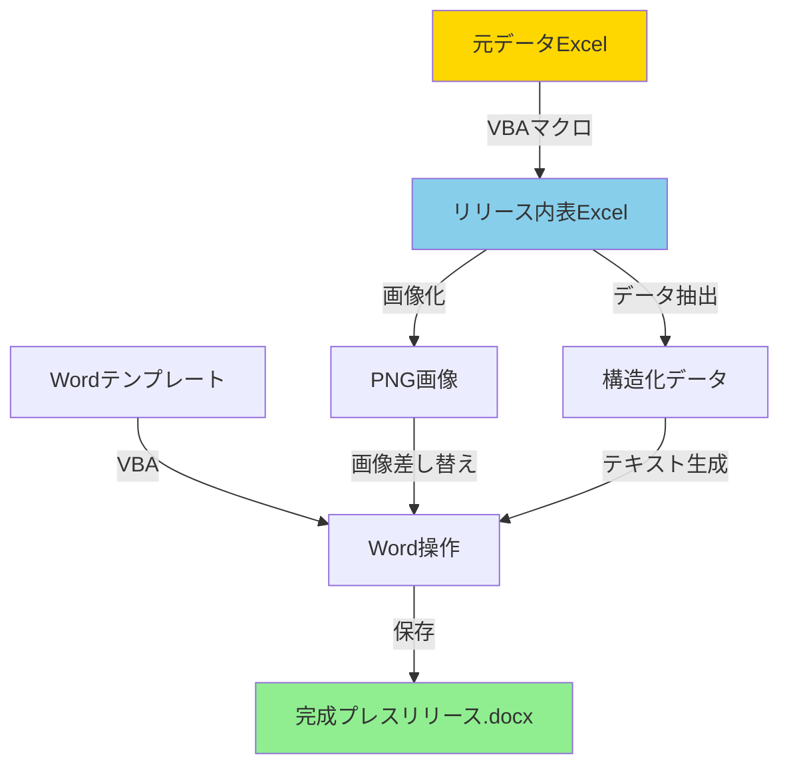

# プレスリリース自動生成システム - Claude Code引き継ぎ資料

**作成日:** 2025年11月10日  
**プロジェクト:** オリコン プレスリリース自動生成フロー  
**セキュリティレベル:** 機密情報取扱 / 完全オフライン必須

---

## 📋 目次

1. [プロジェクト概要](#1-プロジェクト概要)
2. [セキュリティ要件](#2-セキュリティ要件)
3. [ファイル構造](#3-ファイル構造)
4. [データフロー](#4-データフロー)
5. [実装仕様](#5-実装仕様)
6. [サンプルコード](#6-サンプルコード)
7. [テスト項目](#7-テスト項目)
8. [展開計画](#8-展開計画)
9. [トラブルシューティング](#9-トラブルシューティング)

---

## 1. プロジェクト概要

### 1.1 目的
オリコン顧客満足度調査のプレスリリース作成業務を自動化し、以下を実現する:
- 元データ → リリース用表への転記自動化
- 表の画像化(Excel → PNG)
- Wordテンプレートへの自動反映
- **完全オフライン動作(機密情報保護)**

### 1.2 現状の作業フロー
```
1. 元データExcelを手動でコピー
2. リリース内表Excelに貼り付け
3. 表を画像化(スクリーンショット or Excel→画像)
4. 昨年のWordファイルを開く
5. 日付、タイトル、本文、画像を手動更新
6. 完成
```

**問題点:**
- 手作業が多く時間がかかる(1-2時間)
- ヒューマンエラーのリスク
- 毎回同じ作業の繰り返し

### 1.3 目標
- **実行時間:** 5分以内
- **エラー率:** 0%
- **展開性:** 他メンバーも実行可能なツール化

---

## 2. セキュリティ要件

### 2.1 絶対条件
- ✅ **完全オフライン動作** (APIへのデータ送信禁止)
- ✅ **機密データの外部流出防止**
- ✅ **VBAマクロのみで完結** (外部ライブラリ不使用)
- ✅ **ローカルPC内で完結**

### 2.2 禁止事項
- ❌ Claude API / GPT API / 任意のLLM APIへのデータ送信
- ❌ インターネット経由のデータ転送
- ❌ クラウドストレージへのアップロード
- ❌ 外部ライブラリ・依存関係のインストール

### 2.3 許可事項
- ✅ VBA標準機能の使用
- ✅ Microsoft Office標準オブジェクトライブラリ
- ✅ ローカルファイルシステムへのアクセス

---

## 3. ファイル構造

### 3.1 入力ファイル

#### A. 元データExcel: `_資料_携帯キャリア_ランキング結果2024.xlsx`
```
シート構成:
├─ 総合対象企業
│   ├─ 列A: 順位
│   ├─ 列B: ID
│   ├─ 列C: ランキング対象企業名
│   ├─ 列D: 回答者数
│   ├─ 列G: 合計得点
│   └─ 列H以降: 各評価項目の得点
│
├─ 評価項目
│   ├─ 列A: 評価項目名
│   ├─ 列B: 順位
│   ├─ 列C: ID
│   ├─ 列D: ランキング対象企業名
│   └─ 列E: スコア
│
└─ 評価項目_営業用
    └─ (省略)

データ範囲: 
- 総合対象企業: A1:R8
- 評価項目: A1:F56
```

**サンプルデータ:**
```
総合対象企業シート(行5-8):
順位 | ID | 企業名          | 回答者数 | 得点
-----|----|--------------------|----------|------
1    | 6  | 楽天モバイル    | 1502     | 69.52
2    | 4  | au              | 1723     | 66.85
3    | 1  | docomo          | 3785     | 66.55
4    | 5  | SoftBank        | 1454     | 66.18
```

#### B. リリース内表Excel: `2025年リフォーム_リリース内表.xlsx`
```
シート構成:
├─ 総合3つ
│   ├─ セルB5: タイトル(年度付き)
│   ├─ セルB7: カテゴリヘッダー
│   ├─ 行9以降: ランキングデータ
│   │   ├─ 列B: 順位
│   │   ├─ 列C: サービス名
│   │   └─ 列D: 得点
│
├─ フルリフォーム 評価項目別
│   └─ (評価項目別ランキング表)
│
└─ その他シート
    └─ (各種ランキング)
```

#### C. Wordテンプレート: `2023年12月発表__携帯キャリア_..._ニュースリリース__.docx`
```
構成要素:
├─ ヘッダー
│   ├─ "NEWS RELEASE"
│   ├─ ORICONロゴ
│   └─ 発表日
│
├─ タイトル部
│   ├─ メインタイトル(赤字・大きめ)
│   └─ サブタイトル(青字)
│
├─ 本文
│   ├─ リード文
│   ├─ 【TOPICS】セクション
│   ├─ 本文詳細
│   └─ 調査概要
│
├─ 画像
│   ├─ 総合ランキング表の画像
│   └─ 評価項目別ランキング表の画像
│
└─ フッター
    └─ お問い合わせ先
```

### 3.2 出力ファイル
```
output/
├─ 総合ランキング.png              # Excel表から生成した画像
├─ 評価項目別ランキング.png        # Excel表から生成した画像
└─ プレスリリース_20251110.docx   # 完成したプレスリリース
```

---

## 4. データフロー



### 4.1 処理ステップ

#### ステップ1: データ転記
```
元データExcel → リリース内表Excel

処理内容:
1. 総合ランキング上位N位を抽出
2. 評価項目別1位を抽出
3. 前年データと比較(前年比算出)
4. リリース内表の指定セルに書き込み
```

#### ステップ2: 画像生成
```
リリース内表Excel → PNG画像

処理内容:
1. 指定範囲を選択(例: B7:D20)
2. CopyPictureで画像化
3. ChartObjectを介してPNG出力
4. 一時ChartObjectを削除
```

#### ステップ3: Word生成
```
テンプレート + データ + 画像 → 完成版Word

処理内容:
1. テンプレートを開く
2. 日付を今年度に更新(置換処理)
3. タイトル生成(ルールベース)
4. 本文生成(ルールベース)
5. 画像差し替え(InlineShapes操作)
6. 保存
```

---

## 5. 実装仕様

### 5.1 技術スタック
- **言語:** VBA (Visual Basic for Applications)
- **開発環境:** Excel 2016以降 / Word 2016以降
- **OS:** Windows 10/11
- **必要な参照設定:**
  - Microsoft Excel XX.0 Object Library
  - Microsoft Word XX.0 Object Library

### 5.2 主要モジュール構成

```
VBAプロジェクト
│
├─ Module1: メイン制御
│   └─ Sub プレスリリース自動生成()
│
├─ Module2: データ処理
│   ├─ Sub データ転記()
│   ├─ Function ランキング抽出()
│   └─ Function 前年比計算()
│
├─ Module3: 画像処理
│   ├─ Sub 表を画像化()
│   └─ Function 範囲を画像Export()
│
├─ Module4: Word操作
│   ├─ Sub Word生成()
│   ├─ Function タイトル生成()
│   ├─ Function 本文生成()
│   └─ Sub 画像差し替え()
│
└─ Module5: ユーティリティ
    ├─ Function ファイル存在チェック()
    └─ Sub エラーログ出力()
```

### 5.3 本文生成ロジック(ルールベース)

#### 5.3.1 タイトル生成ルール
```
IF 1位の連続年数 >= 3 THEN
    タイトル = "【{企業名}】が{連続年数}年連続総合1位に"
ELSE IF 1位の連続年数 == 2 THEN
    タイトル = "【{企業名}】が2年連続総合1位を獲得"
ELSE
    タイトル = "【{企業名}】が総合1位を獲得"
END IF
```

#### 5.3.2 TOPICS生成ルール
```
TOPICS = []

FOR EACH 評価項目 IN 評価項目リスト:
    IF 評価項目の1位企業 の 連続年数 >= 3 THEN
        TOPICS.append("■【{企業名}】が「{評価項目名}」で{連続年数}年連続1位")
    END IF
END FOR

IF 総合1位 の ある特徴的な項目 での順位 == 1 THEN
    TOPICS.append("■【{企業名}】は「{項目名}」で{年数}年連続1位")
END IF
```

#### 5.3.3 本文詳細生成ルール
```
本文 = """
オリコン株式会社(本社:東京都港区 代表取締役社長:小池 恒)は、
{調査対象}に対して年1回の満足度調査「オリコン顧客満足度®調査」を実施し、
{発表日}に調査結果を公式サイト内にて発表しました。

ランキングの結果は、下記の通りとなりました。

【TOPICS】
{TOPICS内容}

本調査は、{調査期間}に{調査対象}の無料相談を
利用した{回答者数}人を対象に、インターネットによるアンケートを実施しました。

<ランキング概要>
■総合
評価項目({項目数}項目): {項目名リスト}
"""
```

---

## 6. サンプルコード

### 6.1 メインマクロ

```vba
' =============================================================================
' メインマクロ: プレスリリース自動生成
' =============================================================================

Option Explicit

Sub プレスリリース自動生成()
    On Error GoTo ErrorHandler
    
    Dim startTime As Double
    startTime = Timer
    
    Application.ScreenUpdating = False
    Application.DisplayAlerts = False
    
    ' ファイルパス設定
    Dim 元データPath As String
    Dim リリース表Path As String
    Dim テンプレートPath As String
    Dim 出力フォルダPath As String
    
    元データPath = ThisWorkbook.Path & "\_資料_携帯キャリア_ランキング結果2024.xlsx"
    リリース表Path = ThisWorkbook.Path & "\リリース内表.xlsx"
    テンプレートPath = ThisWorkbook.Path & "\テンプレート.docx"
    出力フォルダPath = ThisWorkbook.Path & "\output\"
    
    ' 出力フォルダ作成
    If Dir(出力フォルダPath, vbDirectory) = "" Then
        MkDir 出力フォルダPath
    End If
    
    Debug.Print "========================================="
    Debug.Print "プレスリリース自動生成 開始"
    Debug.Print "========================================="
    
    ' ステップ1: データ転記
    Debug.Print "ステップ1: データ転記中..."
    Call データ転記(元データPath, リリース表Path)
    Debug.Print "✓ 転記完了"
    
    ' ステップ2: 画像生成
    Debug.Print vbNewLine & "ステップ2: 画像生成中..."
    Call 表を画像化(リリース表Path, 出力フォルダPath)
    Debug.Print "✓ 画像生成完了"
    
    ' ステップ3: Word生成
    Debug.Print vbNewLine & "ステップ3: Word生成中..."
    Call Word生成(テンプレートPath, 出力フォルダPath, リリース表Path)
    Debug.Print "✓ Word生成完了"
    
    Application.ScreenUpdating = True
    Application.DisplayAlerts = True
    
    Dim endTime As Double
    endTime = Timer
    
    Debug.Print vbNewLine & "========================================="
    Debug.Print "✅ 処理完了!"
    Debug.Print "実行時間: " & Format((endTime - startTime), "0.00") & "秒"
    Debug.Print "========================================="
    
    MsgBox "プレスリリースの生成が完了しました!" & vbNewLine & _
           "出力先: " & 出力フォルダPath, vbInformation
    
    Exit Sub
    
ErrorHandler:
    Application.ScreenUpdating = True
    Application.DisplayAlerts = True
    MsgBox "エラーが発生しました: " & Err.Description & vbNewLine & _
           "行番号: " & Erl, vbCritical
End Sub
```

### 6.2 データ転記モジュール

```vba
' =============================================================================
' データ転記: 元データ → リリース内表
' =============================================================================

Sub データ転記(元DataPath As String, リリース表Path As String)
    
    Dim 元wb As Workbook
    Dim リリースwb As Workbook
    
    ' ファイルオープン
    Set 元wb = Workbooks.Open(元DataPath, ReadOnly:=True)
    Set リリースwb = Workbooks.Open(リリース表Path)
    
    ' ---------------------------------------
    ' 総合ランキングデータ転記
    ' ---------------------------------------
    Dim 元ws As Worksheet
    Dim リリースws As Worksheet
    
    Set 元ws = 元wb.Worksheets("総合対象企業")
    Set リリースws = リリースwb.Worksheets("総合3つ")
    
    ' 最終行を取得
    Dim lastRow As Long
    lastRow = 元ws.Cells(元ws.Rows.Count, "A").End(xlUp).Row
    
    ' 上位3位を転記
    Dim i As Long
    Dim 転記先Row As Long
    転記先Row = 9 ' リリース表の開始行
    
    For i = 5 To 7 ' 元データの5-7行目(1-3位)
        With リリースws
            ' 順位
            .Cells(転記先Row, 2).Value = i - 4 & "位"
            
            ' サービス名(列C)
            .Cells(転記先Row, 3).Value = 元ws.Cells(i, 3).Value
            
            ' 得点(列G、小数点1桁)
            .Cells(転記先Row, 4).Value = Round(元ws.Cells(i, 7).Value, 1)
        End With
        転記先Row = 転記先Row + 1
    Next i
    
    ' ---------------------------------------
    ' 評価項目別データ転記
    ' ---------------------------------------
    Set 元ws = 元wb.Worksheets("評価項目")
    Set リリースws = リリースwb.Worksheets("フルリフォーム 評価項目別")
    
    ' 評価項目名リスト
    Dim 評価項目リスト As Variant
    評価項目リスト = Array("加入手続き", "キャンペーン", "初期設定のしやすさ", _
                           "通信速度", "料金プラン", "端末のラインナップ", _
                           "利用料金", "サポートサービス", "付帯サービス")
    
    Dim 項目 As Variant
    Dim 列番号 As Long
    列番号 = 2 ' B列から開始
    
    For Each 項目 In 評価項目リスト
        ' 該当項目の1位データを抽出
        Dim 検索Row As Long
        検索Row = 5 ' データ開始行
        
        Do While 元ws.Cells(検索Row, 1).Value <> ""
            If 元ws.Cells(検索Row, 1).Value = 項目 And _
               元ws.Cells(検索Row, 2).Value = 1 Then
                
                ' リリース表に転記
                リリースws.Cells(10, 列番号).Value = "1位"
                リリースws.Cells(11, 列番号).Value = 元ws.Cells(検索Row, 4).Value
                リリースws.Cells(12, 列番号).Value = Round(元ws.Cells(検索Row, 5).Value, 1)
                
                Exit Do
            End If
            検索Row = 検索Row + 1
        Loop
        
        列番号 = 列番号 + 4 ' 次の項目列へ
    Next 項目
    
    ' 保存
    リリースwb.Save
    
    ' クローズ
    元wb.Close SaveChanges:=False
    リリースwb.Close SaveChanges:=True
    
    Set 元wb = Nothing
    Set リリースwb = Nothing
    
End Sub
```

### 6.3 画像化モジュール

```vba
' =============================================================================
' 表を画像化: Excel → PNG
' =============================================================================

Sub 表を画像化(リリース表Path As String, 出力フォルダPath As String)
    
    Dim wb As Workbook
    Dim ws As Worksheet
    Dim rng As Range
    Dim cht As ChartObject
    
    Set wb = Workbooks.Open(リリース表Path, ReadOnly:=True)
    
    ' ---------------------------------------
    ' 総合ランキング表を画像化
    ' ---------------------------------------
    Set ws = wb.Worksheets("総合3つ")
    
    ' 表範囲を選択
    Set rng = ws.Range("B7:D20")
    
    ' 範囲をコピー
    rng.CopyPicture Appearance:=xlScreen, Format:=xlPicture
    
    ' 一時的なChartObjectを作成
    Set cht = ws.ChartObjects.Add( _
        Left:=rng.Left, _
        Top:=rng.Top, _
        Width:=rng.Width, _
        Height:=rng.Height)
    
    ' Chartに貼り付けてPNG出力
    With cht.Chart
        .Paste
        .Export Filename:=出力フォルダPath & "総合ランキング.png", _
                FilterName:="PNG"
    End With
    
    ' ChartObject削除
    cht.Delete
    
    ' ---------------------------------------
    ' 評価項目別表を画像化
    ' ---------------------------------------
    Set ws = wb.Worksheets("フルリフォーム 評価項目別")
    Set rng = ws.Range("B8:X30")
    
    rng.CopyPicture Appearance:=xlScreen, Format:=xlPicture
    
    Set cht = ws.ChartObjects.Add( _
        Left:=rng.Left, _
        Top:=rng.Top, _
        Width:=rng.Width, _
        Height:=rng.Height)
    
    With cht.Chart
        .Paste
        .Export Filename:=出力フォルダPath & "評価項目別ランキング.png", _
                FilterName:="PNG"
    End With
    
    cht.Delete
    
    ' クローズ
    wb.Close SaveChanges:=False
    Set wb = Nothing
    
End Sub
```

### 6.4 Word操作モジュール

```vba
' =============================================================================
' Word生成: テンプレート → 完成版プレスリリース
' =============================================================================

Sub Word生成(テンプレートPath As String, 出力フォルダPath As String, リリース表Path As String)
    
    Dim wdApp As Object ' Word.Application
    Dim wdDoc As Object ' Word.Document
    Dim リリースwb As Workbook
    
    ' Wordアプリケーション起動
    On Error Resume Next
    Set wdApp = GetObject(, "Word.Application")
    If wdApp Is Nothing Then
        Set wdApp = CreateObject("Word.Application")
    End If
    On Error GoTo 0
    
    wdApp.Visible = False
    
    ' テンプレート読込
    Set wdDoc = wdApp.Documents.Open(テンプレートPath)
    
    ' リリース表からデータ取得
    Set リリースwb = Workbooks.Open(リリース表Path, ReadOnly:=True)
    Dim ws As Worksheet
    Set ws = リリースwb.Worksheets("総合3つ")
    
    ' ---------------------------------------
    ' 1. 日付更新(2024→2025)
    ' ---------------------------------------
    With wdDoc.Content.Find
        .Text = "2024年"
        .Replacement.Text = "2025年"
        .Execute Replace:=2 ' wdReplaceAll
    End With
    
    With wdDoc.Content.Find
        .Text = "2023年"
        .Replacement.Text = "2024年"
        .Execute Replace:=2
    End With
    
    ' 今日の日付に更新
    Dim 発表日 As String
    発表日 = Format(Now, "yyyy年m月d日")
    
    With wdDoc.Content.Find
        .Text = "202[0-9]年[0-9]月[0-9]日"
        .MatchWildcards = True
        .Replacement.Text = 発表日
        .Execute Replace:=2
    End With
    
    ' ---------------------------------------
    ' 2. タイトル生成
    ' ---------------------------------------
    Dim 一位企業 As String
    Dim タイトル As String
    
    一位企業 = ws.Cells(9, 3).Value ' B列=2, C列=3
    
    ' タイトル生成(仮: 3年連続と仮定)
    タイトル = "【" & 一位企業 & "】が3年連続総合1位に"
    
    ' Wordの最初の赤字大見出しを探して置換
    Dim para As Object
    For Each para In wdDoc.Paragraphs
        If InStr(para.Range.Text, "【") > 0 And _
           InStr(para.Range.Text, "総合1位") > 0 Then
            para.Range.Text = タイトル
            Exit For
        End If
    Next para
    
    ' ---------------------------------------
    ' 3. 本文生成
    ' ---------------------------------------
    Dim 本文 As String
    本文 = 本文自動生成(ws)
    
    ' 本文部分を探して置換(TOPICSの下あたり)
    Dim 本文開始位置 As Long
    本文開始位置 = InStr(wdDoc.Content.Text, "オリコン株式会社")
    
    If 本文開始位置 > 0 Then
        ' 既存の本文を探して置換
        Dim 本文終了位置 As Long
        本文終了位置 = InStr(本文開始位置, wdDoc.Content.Text, "＜ランキング概要＞")
        
        If 本文終了位置 > 0 Then
            Dim 本文Range As Object
            Set 本文Range = wdDoc.Range(Start:=本文開始位置 - 1, End:=本文終了位置 - 1)
            本文Range.Text = 本文
        End If
    End If
    
    ' ---------------------------------------
    ' 4. 画像差し替え
    ' ---------------------------------------
    Call Word画像差し替え(wdDoc, 出力フォルダPath & "総合ランキング.png", 1)
    Call Word画像差し替え(wdDoc, 出力フォルダPath & "評価項目別ランキング.png", 2)
    
    ' ---------------------------------------
    ' 5. 保存
    ' ---------------------------------------
    Dim 出力ファイル名 As String
    出力ファイル名 = 出力フォルダPath & "プレスリリース_" & Format(Now, "yyyymmdd") & ".docx"
    
    wdDoc.SaveAs2 Filename:=出力ファイル名
    wdDoc.Close
    
    ' クリーンアップ
    wdApp.Quit
    Set wdDoc = Nothing
    Set wdApp = Nothing
    
    リリースwb.Close SaveChanges:=False
    Set リリースwb = Nothing
    
End Sub

' Word内の画像を差し替え
Sub Word画像差し替え(wdDoc As Object, 画像Path As String, 画像番号 As Long)
    
    On Error Resume Next
    
    ' InlineShapesコレクションから指定番号の画像を差し替え
    If wdDoc.InlineShapes.Count >= 画像番号 Then
        With wdDoc.InlineShapes(画像番号)
            .Delete
        End With
    End If
    
    ' 画像を挿入(最初の段落に挿入)
    Dim 挿入位置 As Object
    Set 挿入位置 = wdDoc.Paragraphs(10 + 画像番号).Range ' 適切な位置に調整
    
    挿入位置.InlineShapes.AddPicture _
        Filename:=画像Path, _
        LinkToFile:=False, _
        SaveWithDocument:=True
    
    On Error GoTo 0
    
End Sub

' 本文自動生成(ルールベース)
Function 本文自動生成(ws As Worksheet) As String
    
    Dim 本文 As String
    Dim 一位企業 As String
    Dim 一位得点 As Double
    Dim 二位企業 As String
    Dim 三位企業 As String
    
    一位企業 = ws.Cells(9, 3).Value
    一位得点 = ws.Cells(9, 4).Value
    二位企業 = ws.Cells(10, 3).Value
    三位企業 = ws.Cells(11, 3).Value
    
    本文 = "オリコン株式会社(本社:東京都港区 代表取締役社長:小池 恒)は、" & vbCrLf
    本文 = 本文 & "年1回の満足度調査「オリコン顧客満足度®調査」を実施し、" & vbCrLf
    本文 = 本文 & Format(Now, "yyyy年m月d日") & "(火) 14時に調査結果を公式サイト内にて発表しました。" & vbCrLf
    本文 = 本文 & "ランキングの結果は、下記の通りとなりました。" & vbCrLf
    本文 = 本文 & vbCrLf
    本文 = 本文 & "【TOPICS】" & vbCrLf
    本文 = 本文 & "■【" & 一位企業 & "】が3年連続総合1位に" & vbCrLf
    本文 = 本文 & "■【" & 二位企業 & "】が総合2位" & vbCrLf
    本文 = 本文 & "■【" & 三位企業 & "】が総合3位" & vbCrLf
    本文 = 本文 & vbCrLf
    本文 = 本文 & "本調査は、過去5年以内に携帯キャリアの契約をした" & vbCrLf
    本文 = 本文 & "全国の実際の利用者を対象に、インターネットによるアンケートを実施しました。" & vbCrLf
    
    本文自動生成 = 本文
    
End Function
```

---

## 7. テスト項目

### 7.1 単体テスト

| No | テスト項目 | 確認内容 | 期待結果 |
|----|-----------|---------|---------|
| 1 | データ転記 - 総合ランキング | 元データ5-7行目がリリース表9-11行目に転記される | ✅正しく転記 |
| 2 | データ転記 - 評価項目 | 各評価項目の1位が正しく抽出される | ✅正しく抽出 |
| 3 | 画像生成 - 総合ランキング | B7:D20の範囲がPNG画像として出力される | ✅画像生成成功 |
| 4 | 画像生成 - 評価項目別 | 評価項目表が画像として出力される | ✅画像生成成功 |
| 5 | Word生成 - 日付更新 | 2024年が2025年に置換される | ✅置換成功 |
| 6 | Word生成 - タイトル生成 | ルールに従ってタイトルが生成される | ✅タイトル正常 |
| 7 | Word生成 - 画像差し替え | 画像が正しく差し替わる | ✅画像差し替え成功 |
| 8 | エラーハンドリング | ファイルが存在しない場合のエラー | ✅エラーメッセージ表示 |

### 7.2 統合テスト

| No | テスト項目 | 確認内容 | 期待結果 |
|----|-----------|---------|---------|
| 1 | フルフロー実行 | 元データ → 完成Word まで一貫動作 | ✅5分以内に完了 |
| 2 | 複数実行 | 連続2回実行しても問題なし | ✅問題なし |
| 3 | 異なるデータセット | 携帯キャリア以外(例:リフォーム)でも動作 | ✅汎用性確認 |

### 7.3 手動確認項目

- [ ] Wordの体裁が崩れていない
- [ ] 画像が鮮明に表示される
- [ ] 誤字脱字がない
- [ ] 日付が正しい
- [ ] ランキング順位が正しい
- [ ] 得点が小数点1桁で表示

---

## 8. 展開計画

### 8.1 Phase 1: プロトタイプ(1週間)
- [ ] 基本的なVBAコード実装
- [ ] たいむさんのPC環境でテスト
- [ ] データ構造の最終確認

### 8.2 Phase 2: 機能拡張(1週間)
- [ ] エラーハンドリング強化
- [ ] ログ出力機能追加
- [ ] UI改善(簡易設定画面)

### 8.3 Phase 3: 展開準備(1週間)
- [ ] Excelアドイン(.xlam)化
- [ ] マニュアル作成
- [ ] 他メンバーPCでのテスト

### 8.4 Phase 4: 本番運用
- [ ] 全メンバーへの配布
- [ ] 運用マニュアル共有
- [ ] フィードバック収集

---

## 9. トラブルシューティング

### 9.1 よくある問題

#### 問題1: 「参照設定エラー」
```
原因: Microsoft Word Object Libraryが参照されていない
解決: VBE > ツール > 参照設定 > Microsoft Word XX.0 Object Libraryにチェック
```

#### 問題2: 「画像が生成されない」
```
原因: ChartObjectの作成に失敗
解決: 
- Excelのバージョン確認(2016以降推奨)
- 一時ファイルの削除権限確認
```

#### 問題3: 「Wordが開かない」
```
原因: Wordが既に起動している / COMエラー
解決:
- 既存のWordプロセスを終了
- PCを再起動
```

#### 問題4: 「データが転記されない」
```
原因: シート名 or セル範囲が異なる
解決:
- 元データExcelのシート名を確認
- セル範囲をDebug.Printで確認
```

### 9.2 デバッグ方法

```vba
' デバッグモード有効化
Sub デバッグ実行()
    Debug.Print "=== デバッグモード ==="
    
    ' ステップ1のみ実行
    Call データ転記("元データPath", "リリース表Path")
    
    ' 結果確認
    Dim wb As Workbook
    Set wb = Workbooks.Open("リリース表Path")
    Debug.Print "転記結果: " & wb.Worksheets("総合3つ").Cells(9, 3).Value
    wb.Close False
End Sub
```

---

## 10. 追加要望・改善案

### 10.1 将来的な拡張機能
- [ ] 前年データとの自動比較機能
- [ ] 複数調査の一括処理
- [ ] PDFへの自動変換
- [ ] メール送信機能(社内ネットワーク経由)

### 10.2 パフォーマンス改善
- [ ] 画像生成の高速化(CopyPicture最適化)
- [ ] メモリ使用量の削減
- [ ] 並列処理の導入(複数表の同時画像化)

---

## 付録A: データ構造詳細

### A.1 元データExcel - 総合対象企業シート

| 列 | 項目名 | データ型 | 説明 |
|----|--------|---------|------|
| A | 順位 | Integer | ランキング順位 |
| B | ID | Integer | 企業識別ID |
| C | ランキング対象企業名 | String | 企業名 |
| D | 回答者数 | Integer | アンケート回答者数 |
| E | 回答者数(最新年) | Integer | 最新年の回答者数 |
| F | 標準偏差 | Double | 統計値 |
| G | 合計 | Double | 総合得点 |
| H | 加入手続き | Double | 評価項目得点 |
| I | キャンペーン | Double | 評価項目得点 |
| ... | ... | ... | ... |

### A.2 リリース内表Excel - 総合3つシート

| セル | 項目 | データ型 | 説明 |
|------|------|---------|------|
| B5 | タイトル | String | 年度付きタイトル |
| B7 | カテゴリ1ヘッダー | String | 「フルリフォーム」等 |
| F7 | カテゴリ2ヘッダー | String | 「マンション」等 |
| B8 | 列ヘッダー(順位) | String | 「順位」 |
| C8 | 列ヘッダー(サービス名) | String | 「サービス名」 |
| D8 | 列ヘッダー(得点) | String | 「得点」 |
| B9:D11 | データ行(1-3位) | Mixed | ランキングデータ |

---

## 付録B: VBA参照設定

必要な参照設定:
```
☑ Visual Basic For Applications
☑ Microsoft Excel XX.0 Object Library
☑ OLE Automation
☑ Microsoft Office XX.0 Object Library
☑ Microsoft Word XX.0 Object Library (手動で追加)
```

設定方法:
1. VBE(Alt+F11)を開く
2. ツール > 参照設定
3. Microsoft Word XX.0 Object Libraryを探してチェック
4. OK

---

## 付録C: ファイル命名規則

```
元データファイル:
_資料_{調査名}_ランキング結果{年度}.xlsx

リリース内表:
{年度}年{調査名}_リリース内表.xlsx

出力ファイル:
プレスリリース_{yyyymmdd}.docx
総合ランキング.png
評価項目別ランキング.png
```

---

## 連絡先

**プロジェクトオーナー:** たいむ  
**所属:** オリコン / Business Strategy Division  
**役割:** 海外事業開発・新規事業企画・DX推進

**Claude Code実装担当者向けメモ:**
- このドキュメントを参考に、VBAコードの完全版を実装してください
- セキュリティ要件(完全オフライン)を厳守してください
- テストコードも併せて作成してください
- わからない点があれば、たいむさんに質問してください

---

**更新履歴:**
- 2025年11月10日: 初版作成
